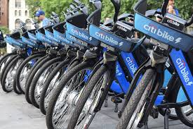

# Module 14 Challenge - NYC Citi Bike Analysis

## Challenge Overview

The goals of this challenge are to:

- Display data professionally and accurately.
- Professionally style a Tableau story.
- Utilize previously created Tableau worksheets to create a new story.
- Create a Tableau story based on starting a bike-sharing company in Des Moines.

## Resources

Data Sources: [201908-citibike-tripdata.csv.zip](https://s3.amazonaws.com/tripdata/index.html), [Encyclopaedia Britannica - Des Moines, Iowa](https://www.britannica.com/place/Des-Moines), [US Census, QuickFacts - NYC vs Des Moines](https://www.census.gov/quickfacts/fact/table/newyorkcitynewyork,desmoinescityiowa/PST045219), [Catch Des Moines](https://www.catchdesmoines.com/), [Des Moines - McDonalds dataset](raw_data/ia_mcdonalds.csv), [NYC - McDonalds dataset](raw_data/ny_mcdonalds.csv)

Software: Tableau, Microsoft Excel

Tableau Story:  <-insert final story link

## Analysis

### Bike-sharing program in Des Moines: a smart, eco-friendly, and profitable solution

**What is the population of Des Moines?** 

**How does its population compare to the population of New York City?**

**Does the population affect the number of people who will use the bike-sharing program?**

+ 3 pieces of supplemental info

- amount of trails/parks to explore (compare DM vs NYC)
- tourism related/partnership opportunities (
- geographical comparison - climate comparison, geographical spread comparison

## Report completed by:

